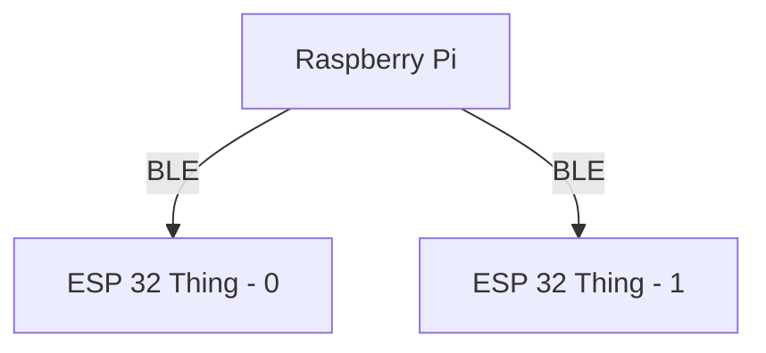

# ECE535

## Motivation

Our motivation for taking on this project stems from our educational background in embedded systems and small devices during our coursework. We find the idea of these devices collaborating, even when dealing with limited power and computing capabilities, incredibly intriguing. This project allows us to dive deeper into exploring this concept and uncover innovative solutions to make it happen.

## Design Goals

Develop a time sync protocol using timestamped sensor data from two embedded devices. The data will be received by a raspberry pi device, and the synchronization protocol will run on the raspberry pi device

## Deliverables

- Characterize the network delay between raspberry pi and the edge device
- Estimate the relative clock drift between the participating devices

## System Blocks

## Hw/sw Requirements

Hardware: ESP32 Things, Raspberry Pi

Software: Embedded Systems programming

## Team Members Responsibilities

****Setup:**** Samridh, Arham

**Software:** Arham

**Networking:** Samridh

**Writing:** Samridh, Arham

**Research:** Samridh, Arham

**Algorithm Design:** Samridh, Arham

## Project Timeline

TBD

## References

- Automated Synchronization of Driving Data Using Vibration and Steering Events
- FLIGHT: clock calibration using fluorescent lighting
- Exploiting Smartphone Peripherals for Precise Time Synchronization
